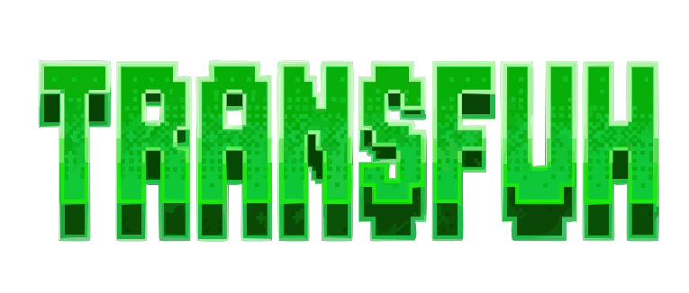

<p align="center">
  
</p>

<h1 align="center">NoLoginTransfer</h1>

<p align="center">
  <strong>Share files with anyone, instantly. Zero servers, zero logins, 100% peer-to-peer.</strong>
</p>

<p align="center">
  <a href="https://transfuh.vercel.app/"><strong>🌐 View Live Demo</strong></a>
</p>

<p align="center">
  <a href="#features">Features</a> •
  <a href="#how-it-works-architecture">Architecture</a> •
  <a href="#tech-stack">Tech Stack</a> •
  <a href="#getting-started">Getting Started</a>
</p>

---

## Overview

**NoLoginTransfer** is a fast, privacy web application that allows users to send files of any size directly to another device. By leveraging WebRTC data channels, files are transferred directly between browsers, meaning your data is **never stored on or routed through a centralized server.**

## Features

* **Direct P2P Transfer:** Uses WebRTC DTLS security to transfer files directly between devices.
* **Adaptive Network Throttling:** Smart backpressure management monitors the browser's network buffer, dynamically yielding to prevent RAM overflow on slower connections.
* **Frictionless Pairing:** Connect instantly using a simple 6-digit room code or by scanning an auto generated QR code.
* **Batch Downloading:** Integrated `JSZip` allows receivers to pack and download all received files as a single `.zip` archive with one click.
* **No Server Storage:** Maximum privacy. Once the browser tab is closed, the connection is destroyed.

## How it Works (Architecture)

1. **Signaling:** When a user opens the app, PeerJS connects to a lightweight signaling server merely to exchange connection data (SDP/ICE candidates) via a 6-digit room code.
2. **P2P Connection:** Once the handshake is complete, a direct WebRTC Data Channel is established between the two clients. The signaling server steps out of the way.
3. **Chunking Engine:** When a user uploads a file, the `sendSingleFile` engine reads the file via the HTML5 File API, slices it into 256KB `ArrayBuffer` chunks, and streams them.
4. **Stitching:** The receiving client holds the chunks in memory and re-assembles them into a downloadable `Blob` the moment the `file-end` signal is received.

## 🛠 Tech Stack

* **Frontend Framework:** React (Vite)
* **Styling:** Tailwind CSS
* **P2P Networking:** WebRTC via [PeerJS](https://peerjs.com/)
* **Icons:** Lucide React
* **File Handling:** JSZip, QRCode.react
* **Deployment & Analytics:** Vercel & Vercel Speed Insights

## Getting Started

To run this project locally on your machine:

### Prerequisites
* Node.js (v16 or higher)
* npm or pnpm

### Installation

1. Clone the repository:
   ```bash
   git clone [https://github.com/yourusername/NoLoginTransfer.git](https://github.com/yourusername/NoLoginTransfer.git)